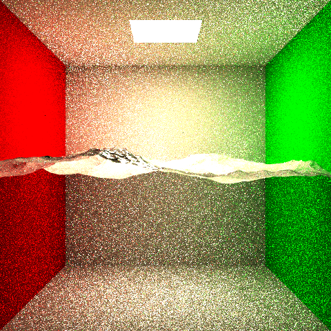
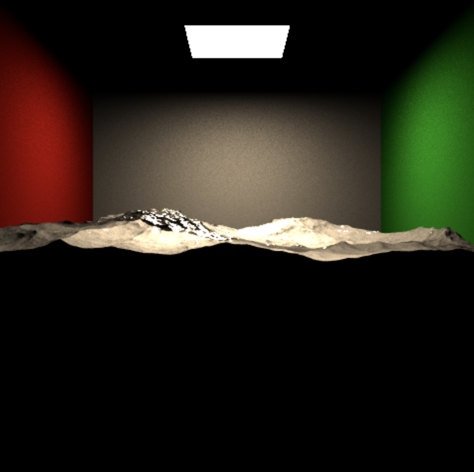
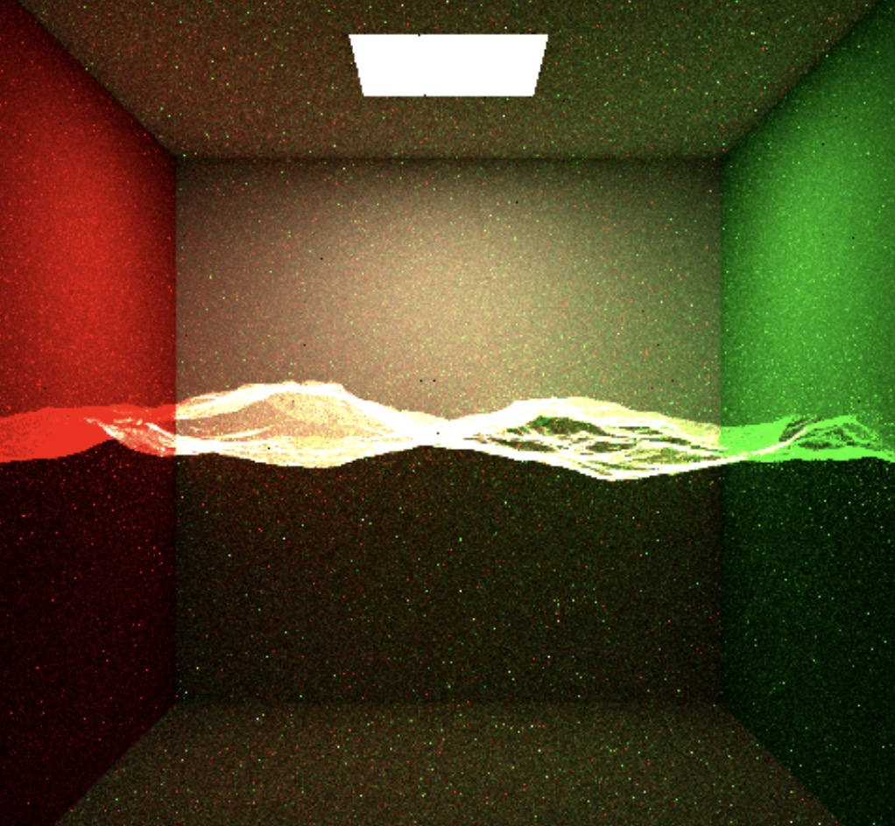
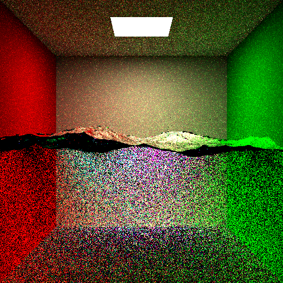
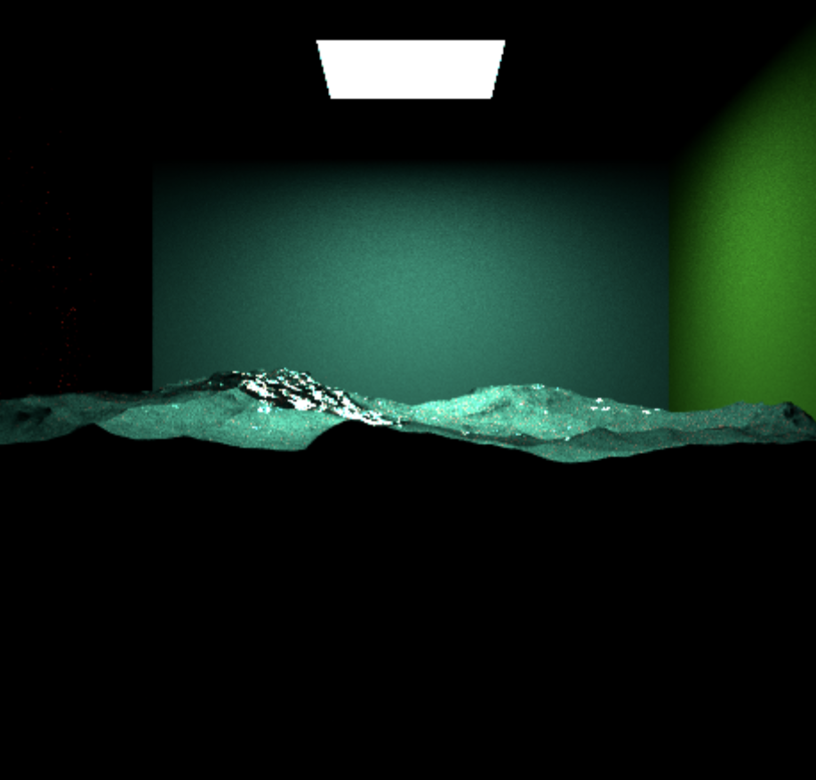
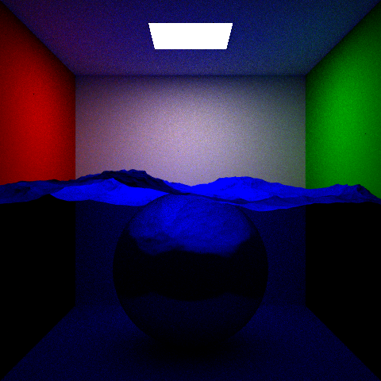
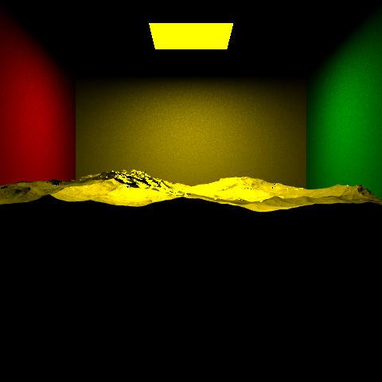
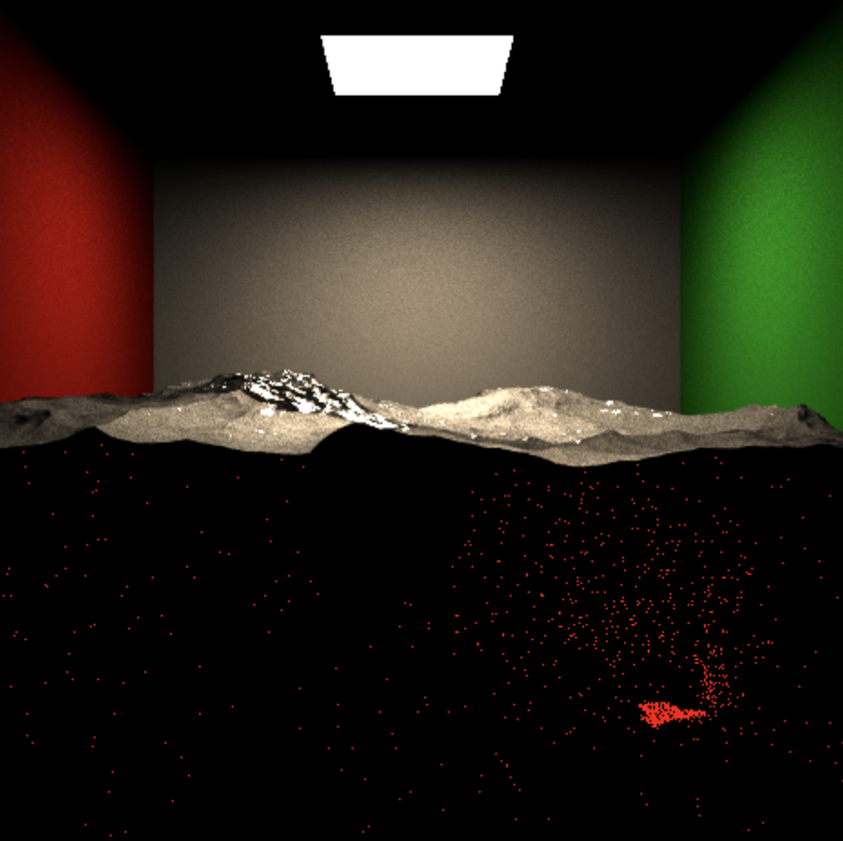

# 168 Final Report - Photon Mapping

## Introduction/ Motivation or Hero Image

For our final project, we want to implement a photon mapping, which can produce caustic effects for underwater scene.

## Model

- The water model downloaded from [Rendering Resources](https://benedikt-bitterli.me/resources/), Water Caustic
by Benedikt Bitterli, using the `mesh001.obj`.
  - Below picture is the water model run with the pathtracer from hw4. 
  - 
- The cornell box model is the same as we used in HW4.

## Implementation

We built this project base on code we have from hw4, things added: 
- A new integrator called `PhotonMapping`, which is in `PhotonMapping.cpp`. 
- An external lirary of kd-tree, from from [KDtree library](https://github.com/cdalitz/kdtree-cpp).(This part is in `kdtree.cpp` and `kdtree.hpp`)
- `buildTree.cpp` and  `buildTree.h` is where we build our kdtree with photon mapping.  

1. Create Photon map, record it in a balanced kdtree
2. Do pathtracing with global photon map

### 1. Create Photon Map

Generate photon according to the light in the scene. Totally three posible light type: point, direct and quadratic ligths.(We only do the quadratic light).

The initial power of photons are depend on the light intensity, with the formula photon power =  $\frac{light.intensity\times Area\times \pi}{numPhotons}$.

And then we do photon trace, emit photons from light, after the first hit, decide which surface does the photon hit. Here we tried several methods.

- The first one is the method from `Siggraph 2000 Course 8`,using the coefficient of diffuse and sepcular of the hitMaterial to calculate the posibility of diffuse reflection and specular reflection, then using the RR. If it is specular reflection, calculate the reflected direction and update the power; if absorbed, just stop; if it is diffuse refection, record the information of the photon in the photon map, and also update position, direction and power, continue reflect photons until reach the maxdepth.
- I also try to use the method we used in HW4, using a t value to decide which reflection it happend.

After record all the information on the diffuse surface, create a kd-tree using external library for the photon map.

The above process is written in the file `buildTree.cpp`.

### 2. Do Pathtracing with Global Photon Map

Trace the ray though the scene, if it have a diffuse reflection, consider the contribution of nearby photons to the color.

At this position where diffuse happen, use `k_nearest_neighbor` function in builtin `kdtree` library to find the k nearest photons of this position.

Then for every photon in the neighbor list, add their contribution to the total output flux.

## Possible Reason of Fail

Even though the program can successfully produce some incorrect images, it may still exist some memory problems. We find that when using the built kd-tree in `PhotonMapping.cpp`, the photon's position and power would unexpectedly change to some really some value (from $10^{-30} \space to \space 10^{-50}$ ). But we also have checked the position and power during building tree, they all looks good.

To debug this out, we tried to add many print statement to track and trace back to where the values become weired, we also tried many different place and method to build the kd-tree. 

## Some images we produced 

Our photon mapping are make up with direct part and photonmapping part, below image is the water model with only direct color. 

We've tried many different ways to debug this, but still fail, below are some attempts we have tried. 

  
  
  
  
  
  

